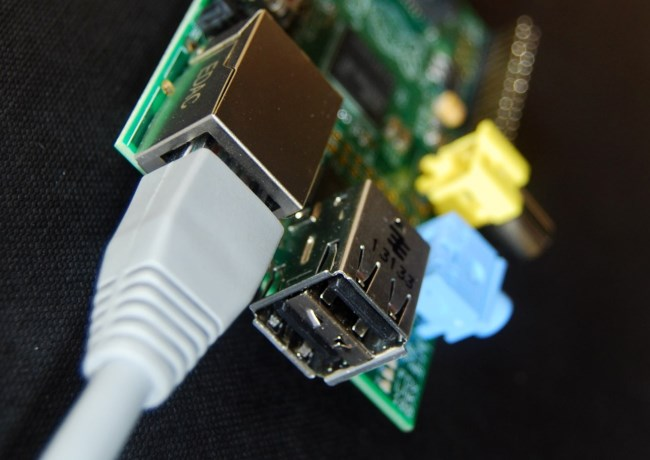

**This is an archived resource.** The repo will remain available but the resource will no longer be maintained or updated. Some or all parts of the resource may no longer work. To see our latest resources, please visit [raspberrypi.org](http://www.raspberrypi.org).

# Networking Lessons

## Introduction

This scheme of work has been designed as an introduction to networking on the Raspberry Pi. Students will set up and use various networks, and will be introduced to basic networking through practical activities.

This scheme of work is specifically targeted towards KS3 and KS4 Computing, although the first two lessons could be used at KS2. It has been developed in the context of the 2014 National Curriculum in England, but is not specific to that programme.

## Learning outcomes:

Over the course of four lessons, students will learn:

- How to network two or more Raspberry Pis together
- How to program a Raspberry Pi to send messages to another Pi
- How to control hardware over a network
- Network configuration and server set up
- Basic networking concepts including:
	- IP address
	- Servers and clients
	- DHCP
	- DNS

## Links to Computing Programme of Study

### KS2:

- Understand computer networks including the internet

### KS3:

- Understand the hardware and software components that make up computer systems, and how they communicate with one another and with other systems.

The lessons use the Python programming language and therefore also address several programming aspects of the programme of study.

[National Curriculum Computing Programmes of Study](https://www.gov.uk/government/publications/national-curriculum-in-england-computing-programmes-of-study/national-curriculum-in-england-computing-programmes-of-study#key-stage-3)

## Resources

It is suggested that work is carried out by students on a Raspberry Pi each or in pairs. Each Raspberry Pi will connect to one other Pi in the first lessons so you will need an even number. Each student or pair should have access to the following equipment:

- A Raspberry Pi with the following set up:
  - The latest NOOBS SD card with Raspbian installed
  - `network.py` and `thing-client.py` copied to the SD card
  - A keyboard, mouse and monitor
  - One network cable between two Raspberry Pis
  - Four female-to-female header leads and one LED (lesson 2 only)

## Lessons

- [Lesson 1: How do computers communicate?](lesson-1/lesson.md)
	- (Note that this lesson requires students to prepare by watching a video beforehand; this can be set as homework from the previous lesson or incorporated where appropriate).
- [Lesson 2: The Internet of Things: How do computers control other computers?](lesson-2/lesson.md)
- [Lesson 3: Dynamic Host Configuration Protocol (DHCP)](lesson-3/lesson.md)
- [Lesson 4: Domain Name System (DNS)](lesson-4/lesson.md)

## Licence

Unless otherwise specified, everything in this repository is covered by the following licence:

***Networking Lessons*** by the [Raspberry Pi Foundation](http://www.raspberrypi.org) is licensed under a [Creative Commons Attribution 4.0 International Licence](http://creativecommons.org/licenses/by-sa/4.0/).

Based on a work at https://github.com/raspberrypilearning/networking-lessons

Lessons 1 and 2 based on ideas and code by [David Whale](https://twitter.com/whaleygeek)
