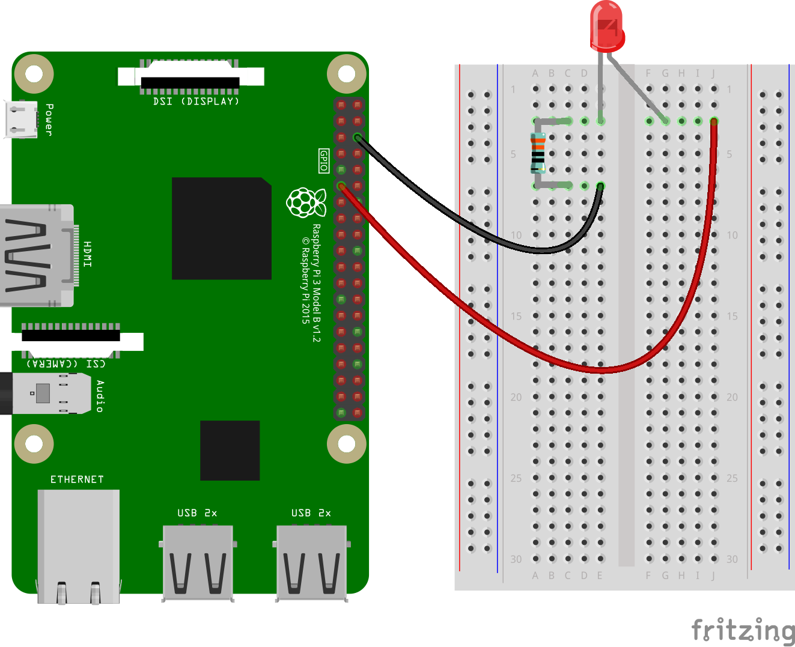
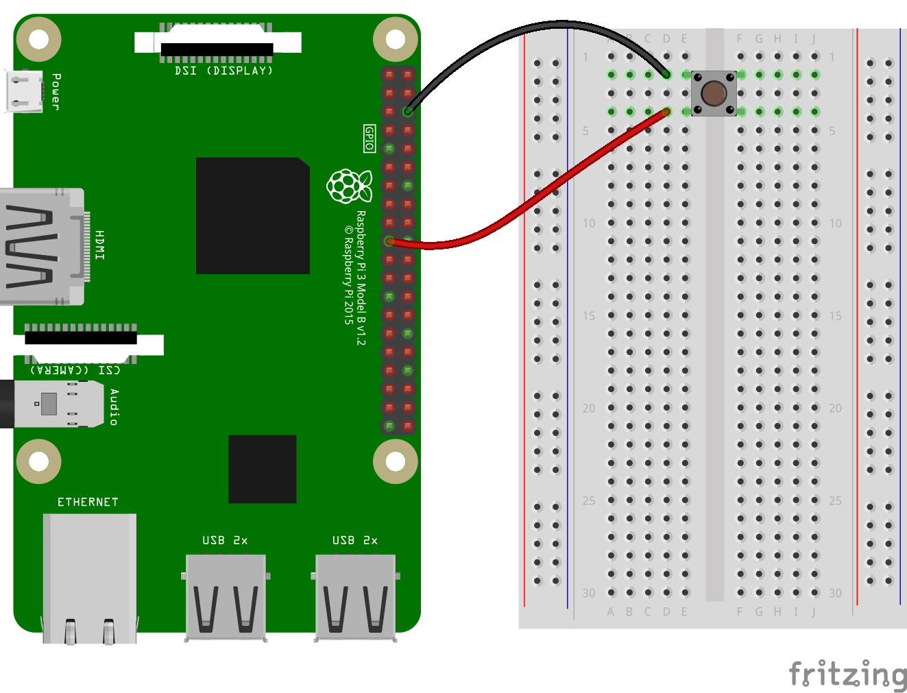

# Controlling physical devices across a network on two Raspberry Pis: Student worksheet

There are three steps to setting up the Raspberry Pis so one can control the other: configuring the network, writing the server program, and setting up the hardware.

## Network configuration

Before the Raspberry Pis can communicate they need to be connected together via a network. Normally, when a device connects to a network, it is assigned a unique identifier called an IP address. As we only have two Raspberry Pis we have to give each Pi its own IP address.

1. [Follow this guide](../rpi-static-ip-address.md) to configure the IP address.

1. Repeat this procedure with your other Pi, giving this one the IP address `192.168.0.3`.

**Tip:** Use a Post-it note to physically label the Raspberry Pis with their IP addresses otherwise things will get confusing later!

### Testing your network

1. Connect the two Pis with an Ethernet cable
1. On the Pi that has the IP address ending `.02`, type:

    ```bash
    ping 192.168.0.3 -c5
    ```

You should see something like this:

```
PING 192.168.0.3 (192.168.0.3) 56(84) bytes of data.
64 bytes from 192.168.0.3: icmp_req=1 ttl=128 time=3.46 ms
[...four more PINGs ...]

--- 192.168.0.3 ping statistics ---
5 packets transmitted, 5 received, 0% packet loss, time 4007ms
rtt min/avg/max/mdev = 3.466/3.788/4.380/0.322 ms
```

If not, check your edits and the network cable. Once the Raspberry Pis are successfully networked you are ready to write the chat program.

## Setting up the control program

1. Create a new file with the nano editor by typing `nano thing-server.py`.
1. Type in the following program:

    ```python
    import RPi.GPIO as GPIO
    import time
    import network

    SWITCH = 10
    GPIO.setmode(GPIO.BCM)
    GPIO.setup(SWITCH, GPIO.IN)

    def heard(phrase):
      print "heard:" + phrase
      for a in phrase:
        if a == "\r" or a == "\n":
          pass # strip it
        else:
          if (GPIO.input(SWITCH)):
            network.say("1")
          else:
            network.say("0")

    while True:
      print "waiting for connection"
      network.wait(whenHearCall=heard)
      print "connected"

      while network.isConnected():
        print "server is running"  
        time.sleep(1)

      print "connection closed"
     ```

1. Save the file with `CTRL-O` and then exit nano with `CTRL-X`.

## Setting up the hardware

**Important**: do not connect hardware directly to the pins! Use female header wires that you can plug onto the GPIO pins and your hardware.

### 1. Set up the client machine with an LED



### 2. Set up the server with a button

Note: you do not need a button, just something to connect the GPIO pin to the ground pin. It could be two paper clips or similar. Again, use header wires that protect the GPIO pins.



## Running the program

The **server** machine is connected to a button. It monitors data from the client machine, and when it receives a '?' character it sends back a '1' if the button is pressed and a '0' if it is not.

The **client** machine is connected to an LED. It sends a '?' character every second to the server, and if it gets back a '1' in reply it turns the LED on.

1. Set the first Pi up as a **server** by typing:

    ```bash
    python thing-server.py
    ```

1. The second Pi will be the **client**. You need to tell it the IP address of the server that you want to connect to. For example, to connect to the Raspberry Pi that has the IP address ending in `.2.`, type:

    ```bash
    python thing-client.py 192.168.0.2
    ```

1. You should now be able to press the button on the Raspberry Pi connected to the server, and the LED will flash on the client. Try it out!

### Things to think about:

- What is happening, physically and electrically, when you press the button?
- What happens at the other end, electrically, when the server receives a signal?

###Things to try:

- Can you break the program by pressing the button too fast?
- Try to change the frequency of the client requests (the `?` character). What happens if they get sent too fast?
- What happens if you stop the server program by pressing `CTRL-C`?

### Programming challenges

- Change the message that appears when your program starts.
- Change the message that appears when a client connects.
- Change the character the client sends every second. Does it matter?
- Make the LED flash more quickly.
- Make the LED flash for a random length of time.
- Comment your code to explain what each section does.

# Cleanup

If the teacher asks you to, change the network configuration back to a dynamic IP address as shown in the "Clean up" section of [the guide](rpi-static-ip-address.md).
