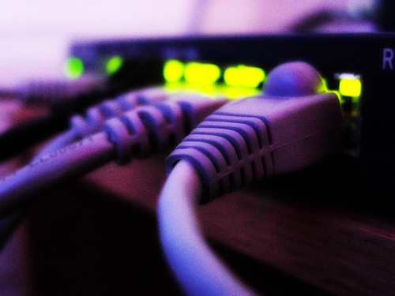

#Dynamic Host Configuration Protocol (DHCP)

This learning resource describes a practical exercise where the Raspberry Pi is used to demonstrate Dynamic Host Configuration Protocol on an isolated network.



## Introduction

By now it will be clear that repeatedly changing the `/etc/network/interfaces` file is time-consuming and laborious. There are a number of disadvantages to giving static IP addresses to all computers on the network. Consider what would happen when you want to add even more computers to your network.

- Users must manually allocate IP addresses
- Users must ensure that no two computers have the same address
- It is time-consuming to edit the configuration file on every computer
- It is not ideal for mobile devices like laptops, which frequently join and leave the network

How can we make this easier?

## Learning objectives

- Understand what Dynamic Host Configuration Protocol (DHCP) is
- Know the role it plays in the overall structure of a computer network

## Learning outcomes

### All students are able to:

- Understand the need for DHCP in a computer network
- Use a DHCP server to acquire an IP address for a Raspberry Pi

### Most students are able to:

- Understand the internal logic of a DHCP server

## Lesson summary

- A discussion of the logical process followed by a DHCP service
- Setting up one Raspberry Pi to be a DHCP server
- Use other Raspberry Pis to get IP addresses from the server
- Testing the network

## Resources

For the majority of the lesson, it is suggested that work is carried out by students in pairs. The Ethernet hub or switch should remain completely isolated, without any Ethernet cables connecting it into the main school network.

You will need:

- A Raspberry Pi per pair of students
- An Ethernet cable per pair
- NOOBS SD card with Raspbian installed per pair
- A keyboard and mouse connected to the RPi per pair
- A monitor connected to the RPi per pair
- An Ethernet hub or switch with enough ports to connect all the RPis
- A set of cards with a selection of numbers on them (starter activity)
- A piece of paper and a pen or pencil (starter activity)

## Lesson introduction

Firstly, go over the concept of a computer *server*. A server is essentially a computer whose main purpose is to provide a service. A web server, for instance, provides the *service* of transmitting web pages, images and files to you over the Internet. A Minecraft server provides the service of preserving the 3D world, remembering what blocks are where and allowing the players to see each other. Servers are computers that are dedicated to a task (but they can be dedicated to more than one).

A computer or application wishing to use a server is often called a *client* because it is like a customer to the server. Web browsers are sometimes called *web clients* because they work like a customer to a web server. You have probably heard your copy of Minecraft referred to as the *game client* for the same reason.

Wouldn't it be great if we could have a server that would take care of allocating IP addresses on our network and remembering who owns what address?

This is exactly what DHCP is for. DHCP stands for Dynamic Host Configuration Protocol; *Dynamic* means constantly changing, *Host* is just another word for a computer, *Configuration* refers to configuring your network settings, and *Protocol* means a set of rules that define how to do things.

## Starter activity

A computing unplugged activity is quite good to get across the logical process followed by the DHCP service.

Begin by nominating one student to be the DHCP server; they own the set of cards, paper, and pen/pencil. The remaining students are now going to be the dynamic hosts/clients (constantly changing computers) on the network.

The DHCP server has a set of rules that must be followed; this is the protocol part of the name. One of the hosts/clients now wants to join the network; their name is *Dave*. This is how the conversation should go:

- HOST: "Hello I am *Dave*, is there a DHCP server out there?"
- DHCP: "Yes I am here, *Dave*. I can offer you address X."
- HOST: "DHCP server, can I take address X please."
- DHCP: "*Dave*, here is address X. You may keep it for 12 hours."

The DHCP server hands over an address card to *Dave* and writes his name on the paper, along with the address that was given, the time *when* it was given, and the length of the lease (12 hours). The time it was given is used to keep track of the age of the lease.

Stop for a moment and consider if there was any part of this conversation that was unexpected. When a computer joins a network it has no way of knowing if a DHCP server is available, so it sends out a broadcast signal to the whole network asking if one is there. If one *is* available it will reply to the host offering an address; the host then officially requests the address. The part you might not have expected is that the address is given with a lease time, in this case 12 hours. Consider why this might be and continue below.

Now let's suppose *Dave* wants to leave the network or is shutting down. The conversation would go like this:

- HOST: "DHCP server, I am *Dave* and I am giving my IP address back to you."
- DHCP: "Thank you *Dave*, goodbye."

*Dave* then hands his address card back to the DHCP server. The DHCP server puts the card back with the others and crosses his name out from the piece of paper. That address card could now be given out to another computer/host that joins the network.

Now consider what might happen if *Dave* didn't shut down cleanly. Suppose the power cable was suddenly unplugged and he didn't get a chance to neatly give his address back to the DHCP server; or perhaps he decided to just run off with the address! What would happen then? The DHCP server won't give out the same address twice, so would the address be forever lost in limbo?

This is where the lease time comes in! The address *will* be in limbo but only until the lease time expires. After 12 hours goes by this might happen:

- HOST: "Hello I am *Fred*, is there a DHCP server out there?"
- DHCP: "Yes I am here *Fred*. It has been over 12 hours since I last heard from *Dave* so I can can offer you his old address X."
- HOST: "DHCP server, can I take address X please."
- DHCP: "*Fred*, here is address X. You may keep it for 12 hours."

The DHCP server makes a new card with that address on, hands it to *Fred*, crosses the name *Dave* off the list, and replaces it with *Fred*.

So that is how this problem is dealt with; all addresses are given out with a time limit attached to them so that in the event of hosts crashing or suddenly leaving the network, the DHCP server will slowly repossess those addresses as their lease times expire.

An alternative version of this conversation might be:

- HOST: "DHCP server I am *Dave*, 12 hours have gone by so can I renew address X please?"
- DHCP: *Dave* you may keep the address for another 12 hours.

The DHCP server then updates the time at which the address was given to Dave on the paper. Note that not all DHCP servers will use a 12 hour lease; it can be either longer or shorter depending on the server in question. Now if *Fred* wants to join the network, he will be given a different address to *Dave*.

## Main practical activity

Firstly, select one Raspberry Pi to act as the DHCP server. It can be a good idea to either put a sticker on it or move it to a more prominent place to avoid any confusion later on. We'll need to install some software on this Pi, so for this first part you'll need to connect it to another LAN for internet access.

### On the server Pi only

**Note:** Because only one Raspberry Pi will be the DHCP server, this part of the activity is best carried out by one person with all the other students observing. We do not need more than one DHCP server; in fact more than one can cause problems!

Enter the following commands:

```bash
sudo apt-get update
sudo apt-get install dnsmasq
```

Once that has finished you can disconnect from the LAN with internet access and return to the original practice hub/switch.

By convention, most DHCP servers have a static IP address which will be the first or lowest number in the IP address space for the network. For example, most private networks use a local IP address space of `192.168.0.X`, where `X` is a number that is different for each device. Following this convention, our DHCP server will have a static IP address of `192.168.0.1`; note the `.1` at the end. The IP addresses it can serve out will then range from `192.168.0.2`, `.3`, `.4`, and so on up to `.254`.

So first, let’s make the DHCP server Raspberry Pi have a static IP address as per this convention. To configure this we must edit the network interfaces file again. Enter the following command:

```bash
sudo nano /etc/network/interfaces
```

In this file `eth0` refers to the Raspberry Pi Ethernet port and `wlan0` refers to a wireless dongle if you are using one. Find the following line:

```bash
iface eth0 inet dhcp
```

This line tells the Raspberry Pi to try and get an IP address from a DHCP server for the interface `eth0`. So essentially this is making it a DHCP *client*, but we want to make this a DHCP *server* so this line must be disabled. Put a hash `#` character at the start of the line and add the following four lines below to configure the static IP address, just as you did in previous exercises:

```
# iface eth0 inet dhcp
auto eth0
iface eth0 inet static
address 192.168.0.1
netmask 255.255.255.0
```

Press `Ctrl – O` then `Enter` to save followed by `Ctrl – X` to quit nano.  Now enter the following command to restart the networking service on the Raspberry Pi:

```bash
sudo service networking restart
```

This Raspberry Pi will now always have the IP address `192.168.0.1`. You can double-check this by entering the command `ifconfig`; the IP address should be shown on the second line just after `inet addr`.

Next we need to configure the DHCP server software, `dnsmasq`, that was installed earlier. We are going to explicitly specify a configuration file for the `dnsmasq` service, so let’s first make a backup of the default config file and then save our one in its place. Enter the following commands:

```bash
cd /etc
sudo mv dnsmasq.conf dnsmasq.default
sudo nano dnsmasq.conf
```

You should now be editing a blank file. Copy and paste the following into it:

```
interface=eth0
dhcp-range=192.168.0.2,192.168.0.254,255.255.255.0,12h
```

The first line tells `dnsmasq` to listen for DHCP requests on the Ethernet port of the Pi. The second line specifies the *range* of IP addresses that can be given out; notice the `12h` at the end of the line which specifies the lease time.

Press `Ctrl – O` then `Enter` to save followed by `Ctrl – X` to quit nano. Before we activate the server, make sure the DHCP server Pi is the only device connected to the practice hub/switch; unplug all other Ethernet connections. Enter the following command to restart the `dnsmasq` service:

```bash
sudo service dnsmasq restart
```

The DHCP service is now active and listening for requests from client host computers.

### On all the remaining client Pis

Before reconnecting any remaining client Pis to the hub/switch, check that their `/etc/network/interfaces` files are configured to get an IP address from a DHCP server. Enter the following command:

```bash
sudo nano /etc/network/interfaces
```

Ensure that a static IP address is *not* specified and check the `iface eth0 inet dhcp` line is there; an example is below.

```
iface eth0 inet dhcp
# auto eth0
# iface eth0 inet static
# address 192.168.0.1
# netmask 255.255.255.0
```

Press `Ctrl – O` then `Enter` to save followed by `Ctrl – X` to quit nano.

Restart the networking service on the clients with the command `sudo service networking restart`; you can then go ahead and start reconnecting them to the hub/switch. They should immediately acquire an IP address from the DHCP server.

Check this by using the command `ifconfig` again; the IP addresses given out should be randomly selected from the range specified on the server.

### Test the network

Once everyone has an IP address the network should work as expected. Test it using your chat program or by playing Minecraft together. Ensure that everyone can successfully ping the DHCP server with the command `ping 192.168.0.1`, and that they can ping each other with the command `ping 192.168.0.X` (where X is the fourth part of their IP address). The server should also be able to ping the clients.

### One step further

If you want to take it one step further and observe the communication between the DHCP server and the clients, the following commands can be used *on the client Pis*.

Firstly, to shut down the Ethernet interface and give back your IP address to the DHCP server enter this command:

```bash
sudo ifdown eth0
```

You should see output similar to the text below. Note the `DHCPRELEASE` line; this is the IP address being surrendered to the server.

```
Listening on LPF/eth0/b8:27:eb:aa:bb:cc
Sending on   LPF/eth0/b8:27:eb:aa:bb:cc
Sending on   Socket/fallback
DHCPRELEASE on eth0 to 192.168.0.1 port 67
```

Next, use the following command to start up the Ethernet interface and get an IP address from the DHCP server:

```bash
sudo ifup eth0
```

You should see output similar to the text below. Note the `DHCPDISCOVER`, `DHCPREQUEST`, `DHCPOFFER`, and `DHCPACK` lines. See how they correspond to what was being spoken during the starter activity?

```
Listening on LPF/eth0/b8:27:eb:aa:bb:cc
Sending on   LPF/eth0/b8:27:eb:aa:bb:cc
Sending on   Socket/fallback
DHCPDISCOVER on eth0 to 255.255.255.255 port 67 interval 7
DHCPREQUEST on eth0 to 255.255.255.255 port 67
DHCPOFFER from 192.168.0.1
DHCPACK from 192.168.0.1
bound to 192.168.0.X -- renewal in 40000 seconds.
```

In normal practice you don’t need to keep using these commands because the same thing automatically happens when the Raspberry Pi boots up, shuts down or has its Ethernet port connected to another device.

## Plenary

Students can now be invited to discuss similarities in the practical exercise to the starter activity.

One question that should be brought up is how the DHCP server can identify each computer that talks to it. In the starter activity the client host computer said “I am Dave” to the DHCP server *before* it had been given an IP address. The DHCP server then wrote *Dave* on the piece of paper against the IP address that was given. What is the equivalent of this for a real computer?

The answer is the *MAC* address (sometimes called the physical address). MAC stands for Media Access Control; it is a unique ID that is burnt into the hardware of an Ethernet device by the manufacturer. All network devices, including those using WiFi and Bluetooth, have a MAC. A MAC address is six bytes long and is often shown as six hexadecimal numbers separated by colons or dashes like this: `01:23:45:67:89:ab`.

The MAC address of a Raspberry Pi can be shown using the `ifconfig` command; look under `eth0` and on the first line just after `HWaddr` (hardware address). The MAC address will be something like `b8:27:eb:aa:bb:cc`. A Raspberry Pi MAC address always starts with `b8:27:eb`. So it’s actually the MAC address of the client host computer that the DHCP server stores to keep a record of who owns which IP address.

Take another look at the `ifup` and `ifdown` command output from earlier!

## Homework

Homework will be an open challenge to find a device in the school or family home that has a built-in DHCP server. Write 100 words about why this DHCP server is being used in this place.
